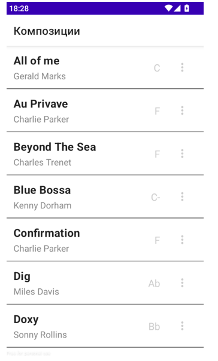
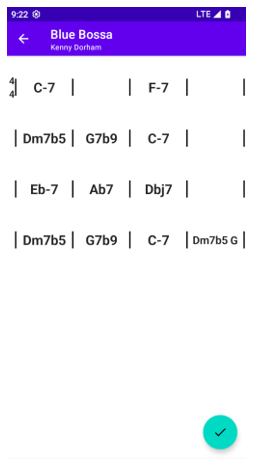

Русская версия: https://github.com/TemSV/learning-jazz-improvization-mobile/blob/main/README_ru.md

# Mobile App for Learning Jazz Improvisation

A mobile application for learning jazz improvisation: it detects harmony patterns and recommends context‑appropriate phrases from solos by well‑known jazz musicians. The key idea is to use a machine learning model to segment note sequences into musical phrases, automatically expanding the recommendation database.

This repository contains the Android app code. ML and backend are located here: https://github.com/TemSV/learning-jazz-improvisation-app

## Purpose

The app allows users to:
- view a list of available songs;
- open the chord grid of a selected song;
- search for harmonic patterns and get recommended musical phrases;
- play recommended phrases by requesting note data from the server.

## Screen–API mapping

Song list
- On app start, the list of songs is requested.
- API: GET /api/songs?q=<search>&limit=<N>&offset=<K>

Chord sequence
- On song tap, the harmonic grid (bars, chords, form sections, time signature) is loaded.
- API: GET /api/songs/{song_id}/chords

Pattern search
- A floating action triggers harmonic pattern analysis for the current song.
- API: GET /api/songs/{song_id}/patterns

Phrase recommendations
- On a highlighted bar tap, the pattern feature vector is sent to retrieve phrases.
- API: POST /api/recommendations/phrases
- Body: { features: [...] }
- Response: items[{ melid, first_note_id, last_note_id, score, chords }]

Phrase playback
- For a selected phrase, note data is requested and played locally.
- API: GET /api/phrases/{melid}/notes?first_note_id=<A>&last_note_id=<B>

## UI and behavior

- Song list screen: sorted by title; loading/error/data states; full‑width song cards with title, composer, key. Lazy scrolling keyed by song id.
- Chord sequence screen: fixed‑column bar grid; time signature displayed on the left as a stacked fraction; form section labels aligned to bar lines on top. Font scales down when multiple chords share a bar, within readability limits.
- Patterns screen: after the API call, bars belonging to detected patterns are highlighted, using distinct colors per pattern type.
- Recommendations modal: infinite list of phrases; each item shows performer, source tune, and a similarity score.
- Playback: pressing Play fetches phrase notes and plays them locally.

## Networking and data handling

- Interfaces for API endpoints are defined; responses are deserialized into DTOs and mapped to domain models.
- A repository layer adapts the network source to business logic, isolating UI from the raw API structure.
- Error handling lives in the repository: each request returns a wrapped result containing either data or an error description, enabling unified state rendering in the UI.

## Build and run

Requirements
- Latest Android Studio
- Installed Android SDK/Build tools
- Reachable server URL with the API running

Steps
1) Clone the repo and open it in Android Studio.
2) Set API base URL (e.g., via BuildConfig).
   Example: buildConfigField "String", "API_BASE_URL", "\"http://10.0.2.2:8000/\""
3) Build and run on an emulator or device.
4) Validate flows:
   - open song list (GET /api/songs);
   - open song chords (GET /api/songs/{song_id}/chords);
   - find patterns (GET /api/songs/{song_id}/patterns);
   - get recommendations (POST /api/recommendations/phrases);
   - play phrase (GET /api/phrases/{melid}/notes).

## Screenshots

