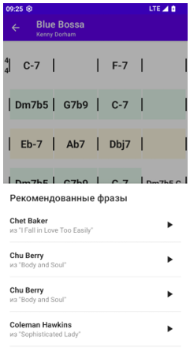

# Jazz Phrase Segmentation AI

A mobile application for learning jazz improvisation: detects harmony patterns and recommends contextually appropriate phrases from solos by renowned jazz musicians. The core idea is to use machine learning to segment note sequences into musical phrases, enabling automatic expansion of the recommendations database.

This repository contains the ML and backend components of the project. [Mobile app code](https://github.com/TemSV/learning-jazz-improvization-mobile)

## Machine Learning Model
- Task: binary classification per note (phrase start vs continuation)
- Data: Weimar Jazz Database (456 solos, 11,082 phrases)
- Architecture: Bi-LSTM + Self-Attention
- Features: pitch/duration/loudness/metric weight, intervals and rests, log-transforms and normalizations
- Training: weighted cross-entropy, AdamW, LR warmup+decay, dropout, early stopping

## Data Preparation
- Dataset based on [Weimar Jazz Database](https://jazzomat.hfm-weimar.de/dbformat/dboverview.html)
- Cleaning and anomaly handling: filling missing values, replacing infinite and NaN values, normalizations and log-transforms for distribution smoothing.
- Feature engineering: relative onsets and durations, normalized intervals and direction of movement, combined pause and inter-note interval features, rhythmic complexity metric and metric weight.
- Scaling: standard feature scaling (StandardScaler) before training.
- Data split: stratified train/val/test = 70%/15%/15% by complexity (number of phrases in melody) to balance styles and solo lengths.

## Neural Network Training
- Loss function: weighted cross-entropy for class imbalance compensation; additional focus on context around phrase starts using distance-based decaying weights.
- Optimization: AdamW (L2=0.01), batch=64, up to 200 epochs, initial LR=0.0003, LambdaLR scheduler with warmup and linear decay.
- Regularization and stability: dropout=0.3, early stopping (patience=15, saving best model), Xavier uniform for linear layers and orthogonal initialization for LSTM recurrent weights.

Training was conducted in Kaggle environment (GPU notebooks); reproducible code and scripts are located in core/ml/kaggle:
- prepare_kaggle_data.py — data and feature preparation
- train_kaggle_model.py — model training launch
- evaluate_kaggle_model.py — evaluation on test set

## Model Results
- Loss: 0.1142
- Precision: 0.8966
- Recall: 0.8302
- F1: 0.8621
- Accuracy: 0.9859

Focus on high precision for correct phrase boчч1undaries.

## Application Architecture

   
  Container diagram

   
  Component diagram

## API
- GET /api/songs
  Paginated list of songs with search by title.
  Parameters: \`q\` (optional), \`limit\` (default 20), \`offset\` (default 0).
  Response: \`{ total, items: [{ id, title }] }\`.

- GET /api/songs/{song_id}/chords
  Chord sequence of the song.
  Path parameters: \`song_id\` (required).
  Response: \`{ song_id, title, bars: [{ id, number, time_signature, chords, section }] }\`.

- GET /api/songs/{song_id}/patterns
  Detected harmonic patterns for the song.
  Path parameters: \`song_id\` (required).
  Response: \`{ song_id, title, patterns: [{ type, key, bar_ids: [..], normalized_chords: [{ chord, duration }], features: [...] }] }\`.

- POST /api/recommendations/phrases
  Phrase recommendations for a given pattern.
  Body: \`{ features: [...] }\` (numeric feature vector of the pattern).
  Response: \`{ items: [{ melid, first_note_id, last_note_id, score, chords }] }\`.

- GET /api/phrases/{melid}/notes
  Notes of the selected phrase for playback.
  Path parameters: \`melid\` (required).
  Query parameters: \`first_note_id\`, \`last_note_id\` (both required).
  Response: \`{ notes: [{ pitch, onset, duration, loudness }] }\`.

## Repository Structure
\`\`\`
.
├─ requirements.txt # Python dependencies
├─ run_parser.py # CLI: parser/harmony analysis launch
├─ preprocess_phrases.py # Phrase feature pre-computation and cache filling

├─ assets/
│  ├─ C4-container.drawio.png # Container diagram (architecture)
│  └─ C4-component.drawio.png # Component diagram (architecture)

├─ api/ # REST API (server)
│  ├─ main.py # ASGI application entry point
│  ├─ dependencies.py # DI/config, service/DB connections
│  ├─ schemas.py # Pydantic request/response schemas
│  └─ routes/ # API routes
│     ├─ songs.py # /api/songs, /api/songs/{id}/chords, /patterns
│     ├─ recommendations.py # /api/recommendations/phrases
│     └─ phrases.py # /api/phrases/{melid}/notes

├─ core/ # Domain logic and ML components
│  ├─ ml/kaggle/ # Data prep/training/evaluation scripts
│  │  ├─ cache/ # Intermediate files/artifacts
│  │  ├─ prepare_kaggle_data.py # Dataset and feature preparation
│  │  ├─ train_kaggle_model.py # Bi-LSTM + Self-Attention training
│  │  └─ evaluate_kaggle_model.py # Test set metrics evaluation
│  ├─ pattern_analysis/ # Chord sequence analysis
│  │  ├─ harmony_analyzer.py # Chord parsing, intervals, pattern search
│  │  ├─ parser.py # Chord/annotation parser from sources
│  │  ├─ patterns.py # Progression template descriptions
│  │  ├─ pattern_manager.py # Management of detected patterns
│  │  ├─ phrase_manager.py # Phrase extraction/context, comparison prep
│  │  └─ models.py # DTOs/data structures (ChordInfo, etc.)
│  └─ utils/ # General utilities
│     ├─ similarity_utils.py # Metrics/cosine similarity and helpers
│     └─ __init__.py

└─ .gitignore # Git exclusions
\`\`\`

## Running the Project

Requirements:
- Python 3.10+
- macOS / Linux / Windows
- Local path to Weimar Jazz Database

Installation:
1) Clone and environment setup
\`\`\`bash
git clone https://github.com/TemSV/learning-jazz-improvisation-app.git
cd learning-jazz-improvisation-app
python -m venv .venv && source .venv/bin/activate  # Windows: .venv\Scripts\activate
\`\`\`

2) Dependencies
\`\`\`bash
pip install --upgrade pip
pip install -r requirements.txt
\`\`\`

3) Environment variables
\`\`\`bash
export WJD_DATA_DIR=/path/to/weimar_jazz_database
export APP_DB_URI=sqlite:///local.db         # or your DB connection string
export API_HOST=0.0.0.0
export API_PORT=8000
\`\`\`

Running the API server:
1) Local run (Uvicorn/FastAPI)
\`\`\`bash
uvicorn api.main:app --host ${API_HOST:-0.0.0.0} --port ${API_PORT:-8000} --reload
\`\`\`

2) Documentation
Open http://localhost:8000/docs

Data preparation and phrase cache:
1) Preprocessing and cache population
\`\`\`bash
python preprocess_phrases.py \
  --data_dir "$WJD_DATA_DIR" \
  --out_db local.db
\`\`\`

2) Single song analysis/parsing
\`\`\`bash
python run_parser.py --song_id 123 --db_uri "$APP_DB_URI"
\`\`\`

Model training (Kaggle GPU, scripts in core/ml/kaggle):
1) Dataset and feature preparation
\`\`\`bash
python core/ml/kaggle/prepare_kaggle_data.py \
  --data_dir "$WJD_DATA_DIR" \
  --out_dir core/ml/kaggle/cache
\`\`\`

2) Bi-LSTM + Self-Attention training
\`\`\`bash
python core/ml/kaggle/train_kaggle_model.py \
  --cache_dir core/ml/kaggle/cache \
  --batch_size 64 --epochs 200 --lr 3e-4
\`\`\`

3) Test set evaluation
\`\`\`bash
python core/ml/kaggle/evaluate_kaggle_model.py \
  --cache_dir core/ml/kaggle/cache
\`\`\`

4) Phrase segmentation inference (example)
\`\`\`bash
python core/ml/kaggle/evaluate_kaggle_model.py \
  --cache_dir core/ml/kaggle/cache \
  --infer_sample /path/to/sample.csv
\`\`\`

## Key Usage Scenarios and Interface Screenshots

User scenarios are described with API mapping.

### Song List
- On screen open, client requests song list: \`GET /api/songs?q=<search>&limit=<N>&offset=<K>\`.
- Response contains \`total\` and \`items[{ id, title }]\`, list is rendered from \`items\`.
- On scroll/search, same endpoint is called with updated parameters.

### Chord Sequence
- On song tap, chord grid is loaded: \`GET /api/songs/{song_id}/chords\`.
- Response: \`{ song_id, title, bars: [{ id, number, time_signature, chords, section }] }\`, bars are displayed in a grid, form sections and time signatures are taken from \`section\` and \`time_signature\`.

### Patterns in Song
- On pattern search button tap: \`GET /api/songs/{song_id}/patterns\`.
- Response includes \`patterns[{ type, key, bar_ids, normalized_chords, features }]\`; bars from \`bar_ids\` are highlighted, color depends on \`type\`.

### Phrase Recommendations
- On bar selection, a request is formed: \`POST /api/recommendations/phrases\` with body \`{ features: [...] }\` from the selected pattern.
- Response: \`items[{ melid, first_note_id, last_note_id, score, chords }]\`; list supports loading next batch of results.

### Phrase Playback
- On "Play" tap, phrase notes are loaded: \`GET /api/phrases/{melid}/notes?first_note_id=<A>&last_note_id=<B>\`.
- Response: \`notes[{ pitch, onset, duration, loudness }]\`, which are played by the built-in player.
