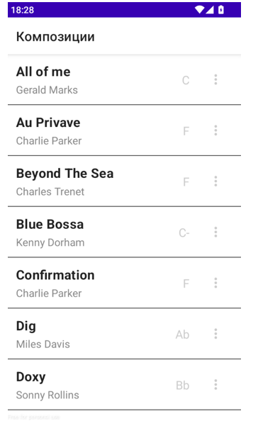
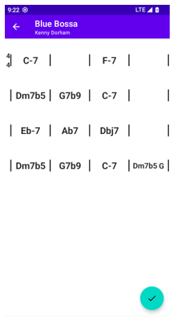
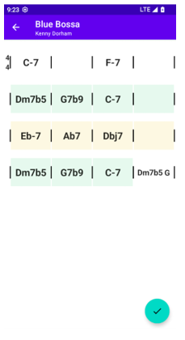
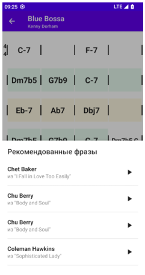

English version: https://github.com/TemSV/learning-jazz-improvization-mobile/blob/main/README.md

# Мобильное приложение для обучения джазовой импровизации

Мобильное приложение для обучения джазовой импровизации: выделяет паттерны гармонии и рекомендует контекстно подходящие фразы из соло известных джазовых музыкантов. Ключевая идея — с помощью модели машинного обучения разбивать последовательность нот на музыкальные фразы, чтобы пополнять базу рекомендаций автоматически.

В данном репозитории находится код Android приложения. ML и backend находятся в репозитории https://github.com/TemSV/learning-jazz-improvisation-app

## Назначение

Приложение позволяет:
- просматривать список доступных композиций;
- открывать аккордовую сетку выбранной песни;
- искать гармонические паттерны и получать рекомендации музыкальных фраз;
- прослушивать рекомендованные фразы, запрашивая нотные данные с сервера.

## Связь экранов с API

Список композиций
- При открытии приложения запрашивается список песен.
- API: GET /api/songs?q=<поиск>&limit=<N>&offset=<K>

Аккордовая последовательность
- При нажатии на песню загружается её гармоническая сетка (такты, аккорды, секции формы, размер).
- API: GET /api/songs/{song_id}/chords

Поиск паттернов
- По кнопке действия выполняется анализ гармонических паттернов для текущей песни.
- API: GET /api/songs/{song_id}/patterns

Рекомендации фраз
- По нажатию на такт с найденным паттерном отправляется вектор признаков паттерна для подбора фраз.
- API: POST /api/recommendations/phrases
- Тело: { features: [...] }
- Ответ: items[{ melid, first_note_id, last_note_id, score, chords }]

Проигрывание фразы
- Для выбранной фразы запрашиваются нотные данные и запускается встроенное воспроизведение.
- API: GET /api/phrases/{melid}/notes?first_note_id=<A>&last_note_id=<B>

## Интерфейс и поведение

- Экран списка песен: сортировка по названию, состояния загрузки/ошибки/данных, карточки во всю ширину с названием, композитором и тональностью. Ленивая прокрутка с ключами по уникальному идентификатору песни.
- Экран аккордовой последовательности: сетка тактов с фиксированным числом колонок, слева отображение размера такта в виде дроби, сверху обозначения секций формы, выравниваемые по тактовым чертам. При множестве аккордов в такте шрифт адаптивно уменьшается в разумных пределах.
- Экран паттернов: после запроса к API подсвечиваются такты, относящиеся к найденным паттернам; разные типы паттернов имеют разные цвета.
- Модальное окно рекомендаций: список рекомендованных фраз с бесконечной прокруткой; элементы содержат информацию об исполнителе, произведении и оценке соответствия.
- Прослушивание: по нажатию на кнопку воспроизведения приложение запрашивает ноты фразы и проигрывает их локально.

## Сетевой слой и обработка данных

- Описаны интерфейсы для конечных точек серверного API; ответы десериализуются в DTO с последующим преобразованием в доменные модели.
- Репозиторий служит слоем адаптации между сетевым источником и бизнес‑логикой, изолируя UI и логику от структуры API.
- Обработка ошибок реализована на стороне репозитория: каждый запрос возвращает объект‑обёртку с успешными данными или описанием ошибки, что позволяет унифицировать отображение состояний на экранах.

## Сборка и запуск

Требования
- Android Studio последней версии
- Установленные Android SDK/Build‑инструменты
- Доступный URL сервера с развернутым API

Шаги
1) Склонируйте репозиторий и откройте проект в Android Studio.
2) Укажите базовый URL API (например, через BuildConfig).
   Пример: buildConfigField "String", "API_BASE_URL", "\"http://10.0.2.2:8000/\""
3) Соберите и запустите приложение на эмуляторе или устройстве.
4) Проверьте сценарии:
   - открыть список песен (GET /api/songs);
   - открыть аккорды песни (GET /api/songs/{song_id}/chords);
   - найти паттерны (GET /api/songs/{song_id}/patterns);
   - получить рекомендации (POST /api/recommendations/phrases);
   - проиграть фразу (GET /api/phrases/{melid}/notes).

## Скриншоты

